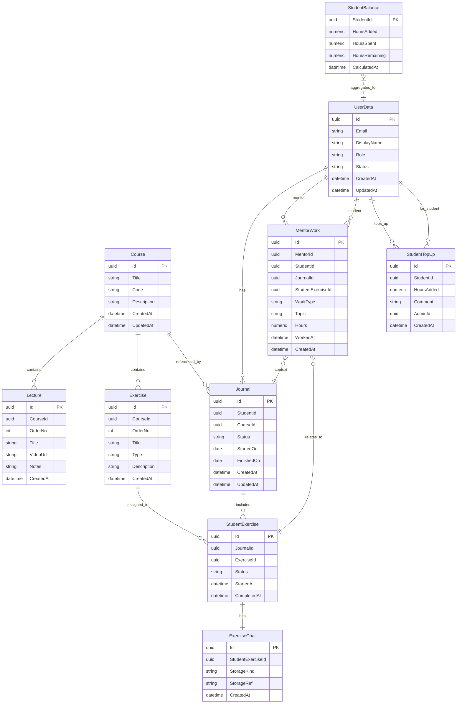

# WorkshopCode — ER Diagram (MVP Core Entities) — Clean Mermaid
Source: WorkshopCode_Brief_MVP.md — Core Entities / Modules

```mermaid
erDiagram
    %% ===== Core identity =====
    UserData {
      uuid Id PK
      string Email
      string DisplayName
      string Role
      string Status
      datetime CreatedAt
      datetime UpdatedAt
    }

    %% ===== Courses / Content =====
    Course {
      uuid Id PK
      string Title
      string Code
      string Description
      datetime CreatedAt
      datetime UpdatedAt
    }

    Lecture {
      uuid Id PK
      uuid CourseId
      int OrderNo
      string Title
      string VideoUrl
      string Notes
      datetime CreatedAt
    }

    Exercise {
      uuid Id PK
      uuid CourseId
      int OrderNo
      string Title
      string Type
      string Description
      datetime CreatedAt
    }

    %% ===== Journal (Student ↔ Course) =====
    Journal {
      uuid Id PK
      uuid StudentId
      uuid CourseId
      string Status
      date StartedOn
      date FinishedOn
      datetime CreatedAt
      datetime UpdatedAt
    }

    StudentExercise {
      uuid Id PK
      uuid JournalId
      uuid ExerciseId
      string Status
      datetime StartedAt
      datetime CompletedAt
    }

    %% ===== Exercise Chat (per StudentExercise) =====
    ExerciseChat {
      uuid Id PK
      uuid StudentExerciseId
      string StorageKind
      string StorageRef
      datetime CreatedAt
    }

    %% ===== Mentor Work (time tracking) =====
    MentorWork {
      uuid Id PK
      uuid MentorId
      uuid StudentId
      uuid JournalId
      uuid StudentExerciseId
      string WorkType
      string Topic
      numeric Hours
      datetime WorkedAt
      datetime CreatedAt
    }

    %% ===== Top-ups (manual by Admin) =====
    StudentTopUp {
      uuid Id PK
      uuid StudentId
      numeric HoursAdded
      string Comment
      uuid AdminId
      datetime CreatedAt
    }

    %% ===== Computed View: Balance =====
    StudentBalance {
      uuid StudentId PK
      numeric HoursAdded
      numeric HoursSpent
      numeric HoursRemaining
      datetime CalculatedAt
    }

    %% ===== Relationships =====
    UserData ||--o{ Journal : has
    UserData ||--o{ MentorWork : mentor
    UserData ||--o{ MentorWork : student
    UserData ||--o{ StudentTopUp : tops_up

    Course ||--o{ Lecture : contains
    Course ||--o{ Exercise : contains
    Course ||--o{ Journal : referenced_by

    Journal ||--o{ StudentExercise : includes
    Exercise ||--o{ StudentExercise : assigned_to

    StudentExercise ||--|| ExerciseChat : has
    MentorWork }o--|| Journal : context
    MentorWork }o--|| StudentExercise : relates_to

    StudentTopUp }o--|| UserData : for_student
    StudentBalance }|..|| UserData : aggregates_for
```
